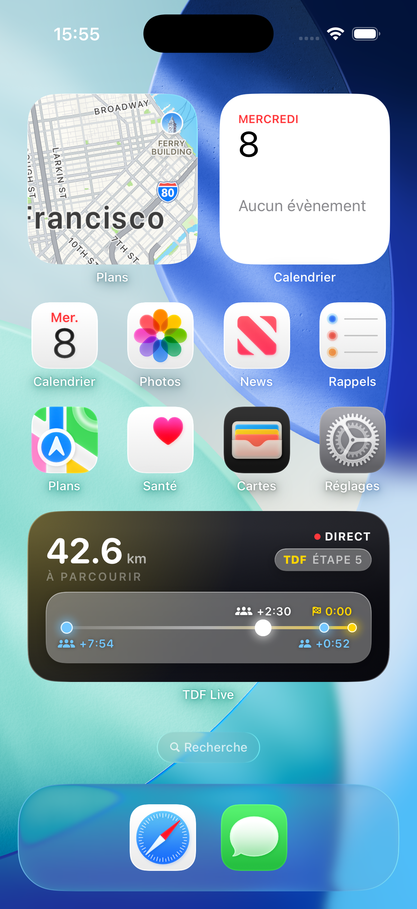
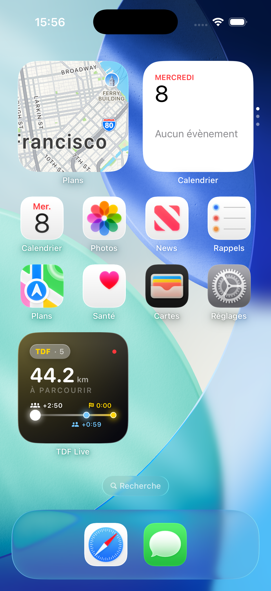
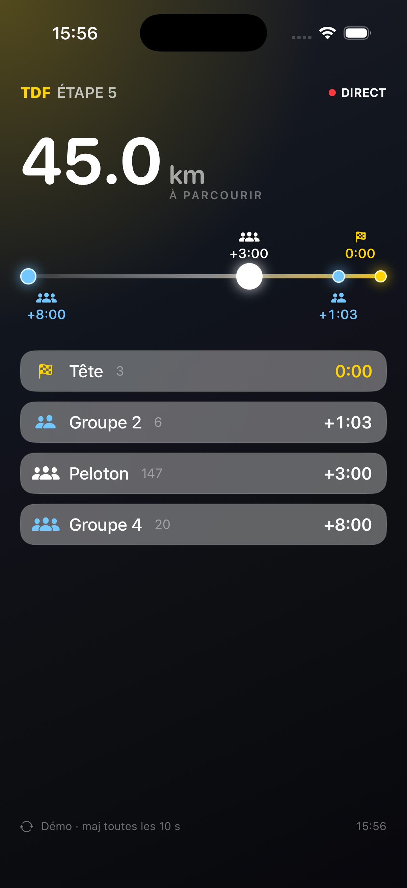

# TDF Live

Suivre le Tour de France en direct — **distance restante** et **écarts entre les groupes** — d'un
coup d'œil, depuis un widget iPhone ou l'app.

## Fonctionnalités

### 🏁 La frise des écarts
Le cœur de l'app : une ligne où chaque groupe est un point placé selon son retard. **La tête de
course est à droite** (drapeau jaune, écart `0:00`), les groupes attardés à gauche. La taille du
point reflète le nombre de coureurs, et l'icône le type de groupe (solo, petit groupe, peloton).

### 📱 Widget écran d'accueil
Deux tailles, en style « liquid glass » (fond sombre, halo jaune) : distance restante en gros +
la frise des écarts. Idéal pour jeter un œil sans ouvrir l'app.

| Widget medium | Widget small | Vue live |
|---|---|---|
|  |  |  |

### 📊 Vue live dans l'app
Écran plein écran qui se met à jour **toutes les 10 s** : la distance, la frise, et le détail de
chaque groupe (nom, nombre de coureurs, écart au leader). Les valeurs s'animent à chaque mise à jour.

### ⚡ En direct
- Distance restante jusqu'à l'arrivée (`km à parcourir`)
- Écarts en temps réel entre tête, peloton et groupes
- Badge **DIRECT** quand une étape est en course
- Numéro d'étape en cours

## Sous le capot

Les données viennent de l'API publique du Tour (`racecenter.letour.fr`). Un petit serveur sur le
Mac les récupère, calcule la distance et regroupe les coureurs par écart, puis l'app et le widget
lisent ce résultat. Détails techniques et mise en route : voir le [dépôt serveur](https://github.com/JulesV19/TDF-live-server) et
`TDF Live/`.
